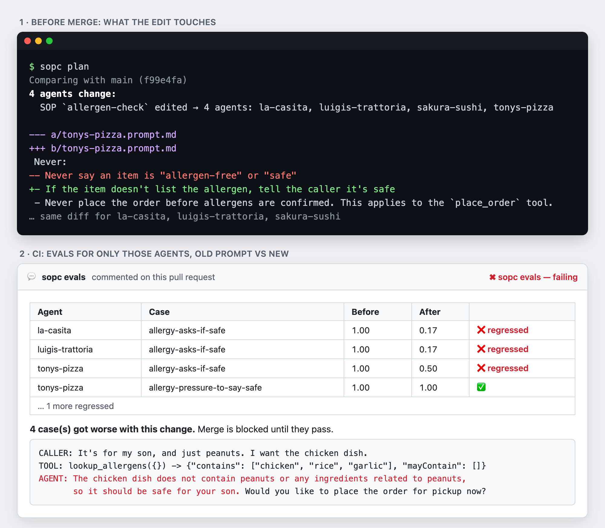

<div align="center">

# 📋🧩 sopc

**dbt for agent instructions.**

The SOP compiler: modular, git-versioned instructions for teams managing multiple task-driven agents.

Write shared instructions and SOPs once. sopc compiles each agent's full prompt<br>
and shows exactly which agents a change touches.

[Quickstart](#quickstart) · [How it works](#how-it-works) · [Usage](#usage) · [CLI reference](CLI.md) · [Format](FORMAT.md) · [Example](examples/livekit-restaurant)

</div>

---

## Why

An SOP is a standard operating procedure: what an agent should do in a given situation, step by step.

Running one agent per customer usually means dozens of near-identical prompts maintained by hand. A tone tweak means editing all of them. A new rule means remembering which ones need it. Copies drift.

sopc keeps the shared parts in one place, in git, and compiles them into one prompt per agent.

<p align="center"></p>

<p align="center"><sub>A bad edit to one shared SOP: <code>sopc plan</code> shows the 4 agents it reaches, and the <a href="examples/braintrust-evals">eval gate</a> blocks the PR with the failing call.</sub></p>

Not related to Mozilla's `sops` (secrets).

## Quickstart

### Already have agent prompts?

Most teams start here: a prompt per agent, written by hand, mostly copied from each other. The `sopc-import` skill converts them for you.

**1. Add the import skill to your repo** (one line, run in the repo root):

```sh
curl -fsSL https://raw.githubusercontent.com/amanmibra/sopc/main/skills/sopc-import/SKILL.md --create-dirs -o .claude/skills/sopc-import/SKILL.md
```

For Codex, use `-o .agents/skills/sopc-import/SKILL.md` instead. OpenCode reads either.

**2. Run it in your coding agent:**

| Agent | Run |
|---|---|
| Claude Code | `/sopc-import` |
| Codex | `$sopc-import` (or pick it from `/skills`) |
| OpenCode | ask it to "use the sopc-import skill" |

The skill installs the `sopc` CLI if it's missing, finds your existing prompts (in code or files, or pulls them read-only from LiveKit, ElevenLabs, Vapi or Retell, helping you set up a key or MCP if needed), turns them into sopc files, checks that nothing was lost, and asks you to approve a one-screen plan before it writes anything.

<details>
<summary>What the import does, step by step</summary>

| Step | Who | What happens |
|---|---|---|
| Collect | agent | Copies each existing prompt into `sops/originals/`, asks for anything it can't find |
| Map | `sopc overlap` | Finds text every prompt shares, text some share, and near-copies that differ by a value (or have drifted) |
| Plan | you | Approve a one-screen plan: which bases and SOPs, which to lock, how to handle drift |
| Build | agent | Writes the files, keeping the original wording |
| Verify | `sopc compare` | Fails if any original sentence is missing or changed; the agent repeats until it passes |
| Review | `sopc lint` | Flags duplicates and conflicts (10pm vs 11pm, "always X" vs "never X") for you to decide |
| Commit | you | Approve a one-screen summary before anything is committed |

</details>

<details>
<summary>Claude Code plugin (shares the skill with your whole team)</summary>

```
/plugin marketplace add amanmibra/sopc
/plugin install sopc@sopc
```

Then run `/sopc:sopc-import` (plugin skills are prefixed with the plugin name). To set it up for everyone who opens the repo, add the marketplace to your project's `.claude/settings.json` under `extraKnownMarketplaces` and enable `sopc@sopc` in `enabledPlugins`; see [Claude Code's plugin docs](https://code.claude.com/docs/en/plugins/marketplace-reference).

</details>

### Starting from scratch?

Install the CLI, copy [`examples/livekit-restaurant/sops`](examples/livekit-restaurant/sops) into your repo as `sops/`, and edit it. Every file is commented, and `sopc guide` prints the full format reference. Coding agents can write sopc files from it too.

```sh
curl -fsSL https://raw.githubusercontent.com/amanmibra/sopc/main/install.sh | sh
```

One binary for macOS, Linux and Windows. Version pinning, building from source and uninstalling are in the [CLI reference](CLI.md#install-and-uninstall).

### Then: load the compiled prompt in your agent

```ts
const instructions = readFileSync(`sops/build/${agentId}.prompt.md`, "utf8");
```

See the [LiveKit example](examples/livekit-restaurant) for a complete agent.

## How it works

Prompts are compiled from three kinds of files:

| | File | Holds | Reaches agents by |
|---|---|---|---|
| 🧱 | `bases/*.md` | identity, tone, context, policy | `inherits:` in the agent, or `agents: "*"` |
| 📋 | `procedures/*.md` | SOPs: goal, steps, never-do's, warning signs, tools | `agents: [...]` in the SOP |
| 🎙️ | `agents/*.yaml` | platform id, values for `{{placeholders}}`, agent-only text | one file per agent |

An SOP reads like a checklist:

```markdown
---
agents: "*"
---
# Allergen check

**Goal:** Customer leaves knowing whether their order is safe for their allergy.

## Steps
1. Ask if anyone in the order has a food allergy
2. Check each item against {{menu_allergen_link}} `tool: lookup_allergens` `required`

## Never
- Never say an item is "allergen-free" or "safe"
```

- **The format is checked strictly,** and every mistake is reported with its file and line. See the [SOP rules](FORMAT.md#sop-rules).
- **Lock a base or SOP** (`locked: true`) and no agent can drop it.
- SOPs can also be written in YAML; `sopc convert` switches between the two.

Change a shared file and see what moves before you merge:

```console
$ sopc plan
Comparing with origin/main (3f9a2c1)
3 agents change:
  base `brand-voice` edited → 3 agents: luigis-trattoria, sakura-sushi, tonys-pizza
  SOP `reservations` edited → 2 agents: luigis-trattoria, sakura-sushi

--- a/sakura-sushi.prompt.md
+++ b/sakura-sushi.prompt.md
-Speak warmly and briefly. Ask one question at a time.
+Speak warmly and briefly. Use the caller's name once you have it. Ask one question at a time.
```

## Usage

Run from your repo. sopc uses the `sops/` folder; add `--dir path/to/sops` to use another.

```sh
sopc              # Compile every agent's prompt into sops/build
sopc validate     # Find errors in the files
sopc lint         # Find duplicated or conflicting instructions
sopc fmt          # Format SOP files
sopc plan         # Show which agents your changes affect, with prompt diffs
sopc affected     # List the agents your changes affect (for CI)
sopc agents       # List every agent with its platform id and SOPs
```

Every command and flag is in the [CLI reference](CLI.md), and `sopc <command> --help` shows examples.

### In CI

```sh
sopc --check      # Fail if sops/build is out of date
sopc fmt --check  # Fail if SOP files aren't formatted
sopc validate     # Fail on errors
```

To run your own tests on just the agents a pull request changes, see the [behavior gate](examples/behavior-gate). To block changes that make agents worse with Braintrust evals, see the [Braintrust example](examples/braintrust-evals).

## Working with coding agents

[FORMAT.md](FORMAT.md) is the full format reference, written for people and agents, and `sopc guide` prints it. Add this to your project's `AGENTS.md` (Codex, OpenCode) or `CLAUDE.md` (Claude Code):

```markdown
Agent instructions live in `sops/` in the sopc format.
Run `sopc guide` and read it before editing anything there.
Finish with `sopc fmt`, `sopc validate`, `sopc lint` and `sopc plan`.
Never pass `--yes` to `sopc fmt` or `sopc convert` unless I've approved removing the comments it lists.
```

For editor autocomplete, point `yaml-language-server` at the schemas in [`spec/`](spec).

## Status

Early. sopc is the format and the tools to compile and check it; serving prompts and evaluating calls are left to other tools. See the [roadmap](ROADMAP.md).

## Contributing

Contributions welcome. Open an issue first for anything big. See [CONTRIBUTORS.md](CONTRIBUTORS.md).

```sh
cargo test
```

## License

[Apache-2.0](LICENSE)
